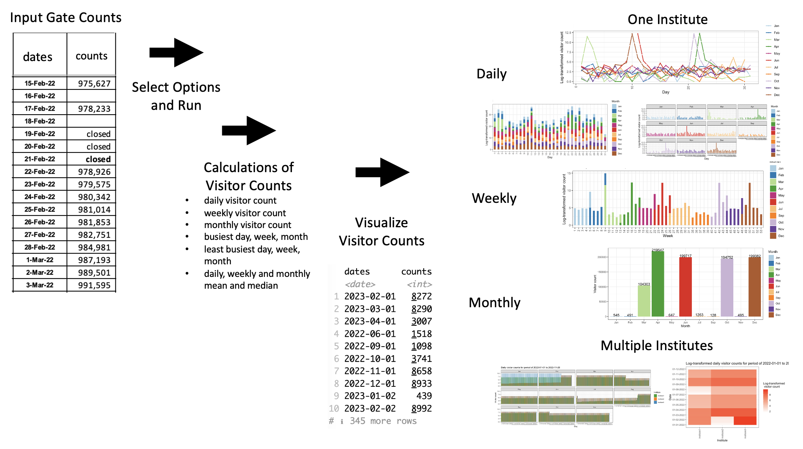
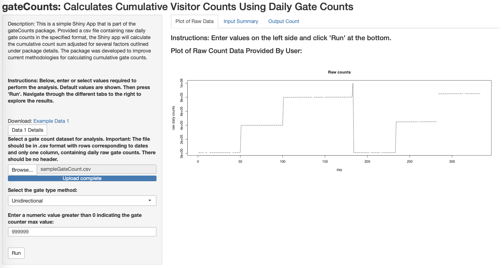

<!-- README.md is generated from README.Rmd. Please edit that file -->

```{r, include = FALSE}
knitr::opts_chunk$set(
  collapse = TRUE,
  comment = "#>",
  fig.path = "man/figures/README-",
  out.width = "100%"
)
```

# gateCounts
Calculates Daily Visitor Counts From Raw Daily Gate Counts, Summarize Visitor Counts and Visualize

<!-- badges: start -->
[](https://github.com/anjalisilva/gateCounts/issues)
[](./LICENSE)


<!-- https://shields.io/category/license -->
<!-- badges: end -->

## Description
`gateCounts` is an R package for calculating daily visitor counts, provided raw daily gate counts, gate directionality, and gate counter maximum value. Calculated visitor counts or user provided visitor counts can be summarized on daily, weekly, monthly basis and visualized. For details see below.

## Installation

To install the latest version of the package:

``` r
require("devtools")
devtools::install_github("anjalisilva/gateCounts",     
                          build_vignettes = TRUE)
library("gateCounts")
```

To run the Shiny app:
``` r
gateCounts::runGateCount()
```


## Overview

To list all functions available in the package:

``` r
ls("package:gateCounts")
```

`gateCounts` package contains 6 functions. 

1.  ***gateCountsToVisitorCounts*** for calculating daily visitor counts, provided a numeric vector or a tibble containing values of raw daily gate counts for one institute, gate directionality and gate counter maximum value. 

2.  ***visitorCountSummary*** for calculating weekly, monthly visitor counts and summary statistics like daily, weekly, monthly mean and median, busiest and least busiest day, week, and month for the entire duration for which visitor count data is provided by user. 

3.  ***gateCountsVisDaily*** permit to create plots (bar,
line, and heatmap) showing daily visitor counts for one institute. Both count and log-transformed count plots are provided to help visualize trends.

4.  ***gateCountsVisWeekly*** for creating plots showing visitor counts by week for one institute. Both count and log-transformed count plots are provided to help visualize trends.

5.  ***gateCountsVisMonthly*** for creating plots showing visitor counts by month for one institute. Both count and log-transformed count plots are provided to help visualize trends.

6.  ***runGateCount*** starts the Shiny app for this R package. Under construction. 

7.  ***gateCountsVisMultiple*** for creating plots comparing visitor counts from multiple institutes. 


An overview of the package is illustrated below:

<div style="text-align:center">



<div style="text-align:left">

<div style="text-align:left">

<div style="text-align:left">

## Details

### Introduction

`gateCounts` is an R package for calculating daily, weekly, monthly, and cumulative visitor counts, provided raw daily gate counts, gate directionality, and gate counter maximum value. The package was developed to improve methodologies for calculating visitor counts from gate counts, initially using library daily gate count values as an example. However, the package can be applied to calculate visitor counts from any setting. The factors adjusted for are outlined below.


### Some Issues & How They Are Handled By Package

1. To calculate visitor counts from raw daily gate counts, today's gate count reading is subtracted from yesterday's reading. Negative visitor counts can result if the gate counter has reset. This package attempts to detect and correct for this.

2. Negative visitor counts can also result from a lower gate count value that has been entered compared to previous day. This may result from manual entry or system errors. This package attempts to detect and correct for this.

3. The package attempts to account for when the daily gate count has been forgotten to be reported or days are skipped. This method doesn’t assign counts for missed days, but rather adjust for cumulative visitor count sum. 

4. The package checks for any  possible non-numeric characters (e.g., "turned off", "Diagnosis", "closed", "Clean filter"), then adjusts for visitor count by taking past, last reported gate count.

Refer to vignette where these issues and solutions are explained with visuals for more information. 


### Directionality
If gates are bidirectional, the visitor counts will be divided by two. For cumulative visitor count, our testing has shown that dividing by two after calculating all daily visitor counts helps to provide a better approximation of cumulative gate count, compared to when the daily visitor counts are divided by two and then summed up at the end. Therefore, for cumulative visitor counts from bidirectional gates, all daily visitor counts are summed at then divided by two. Hence, users may find slight differences between summing up daily visitor counts outputted by the package versus cumulative gate count outputted by the package. Refer to vignette where these issues and solutions are explained with visuals for more information. 

## Shiny App  

The Shiny app employing could be run and results could be visualized:

``` r
gateCounts::runGateCount()
```

<div style="text-align:center">



<div style="text-align:left">
  
## Tutorials  

For tutorials, refer to the vignette: 

``` r
browseVignettes("gateCounts") 
```

## Citation for Package

``` r
citation("gateCounts")
```
Silva, A. (2023). R package for Calculating Daily, Weekly, Monthly, Cumulative, and Summary Statistics of Visitor Counts Provided Raw Daily Gate Counts. Unpublished.

``` r
A BibTeX entry for LaTeX users is

  @misc{,
    title = {R package for Calculating Daily, Weekly, Monthly, Cumulative, and Summary Statistics of Visitor Counts Provided Raw Daily Gate Counts},
    author = {A. Silva},
    year = {2023},
    url = {https://github.com/anjalisilva/gateCounts},
  }
```


## Package References

- [Phillips, J. (2016). Determining Gate Count Reliability in a Library Setting. *Evidence Based Library and Information Practice* 19.](https://journals.library.ualberta.ca/eblip/index.php/EBLIP/article/view/27884/20745)

- [Perera, D. and J. M. Nykolaiszyn (2022). Designing an open-source application to record library gate counts in response to COVID-19. *Journal of Access Services* 19.](https://www.tandfonline.com/doi/abs/10.1080/15367967.2022.2046006?journalCode=wjas20)

- [Müller, K. and H. Wickham (2022). _tibble: Simple Data Frames_. R package version 3.1.8.](https://CRAN.R-project.org/package=tibble)

- [Google. (2022, February 14). Cleaning up gate count statistics. Google Groups. Retrieved September 26, 2022.](https://groups.google.com/a/arl.org/g/arl-assess/c/JQyllZN4gaE)


## Maintainer

* Anjali Silva (anjali@alumni.uoguelph.ca). 


## Contributions

`gateCounts` welcomes issues, enhancement requests, and other contributions. To submit an issue, use the [GitHub issues](https://github.com/anjalisilva/gateCounts).


## Acknowledgments

* This work was done at University of Toronto Libraries, Ontario, Canada from 2022-2023.
