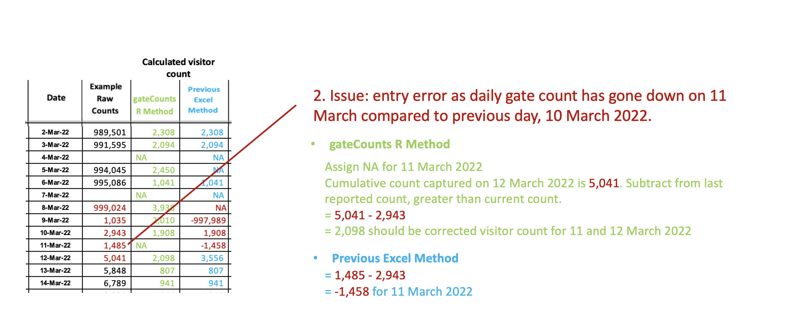
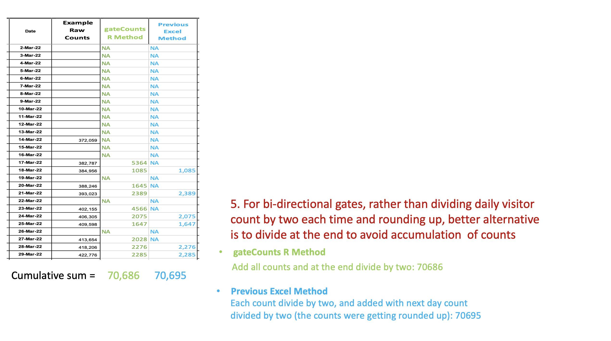

<!-- README.md is generated from README.Rmd. Please edit that file -->

```{r, include = FALSE}
knitr::opts_chunk$set(
  collapse = TRUE,
  comment = "#>",
  fig.path = "man/figures/README-",
  out.width = "100%"
)
```

# gateCounts
Calculates Cumulative Visitor Counts Provided Raw Daily Gate Counts

<!-- badges: start -->
[](https://github.com/anjalisilva/mixMVPLN/issues)
[](./LICENSE)


<!-- https://shields.io/category/license -->
<!-- badges: end -->

## Description
`gateCounts` is an R package for calculating cumulative visitor counts, provided raw daily gate counts, gate directionality and gate counter maximum value. The package was developed for calculating cumulative visitor counts in libraries using daily gate counts. However, the package can be applied to calculate cumulative visitor counts from any setting. 


## Installation

To install the latest version of the package:

``` r
require("devtools")
devtools::install_github("anjalisilva/gateCounts", build_vignettes = TRUE)
library("gateCounts")
```

To run the Shiny app:
``` r
gateCounts::runGateCount()
```


## Overview

To list all functions available in the package:

``` r
ls("package:gateCounts")
```

`gateCounts` package contains 2 functions. The *gateCountCumulative* function calculates cumulative visitor counts, provided a numeric vector or a tibble containing values of raw daily gate counts. The Shiny app employing *gateCountCumulative* function could be run and results could be visualized using *runGateCount()*. For more information, see details section below. 

## Details

### Introduction
`gateCounts` is an R package for calculating cumulative visitor counts, provided raw daily gate counts, gate directionality, and gate counter maximum value. The package was developed to improve methodologies for calculating cumulative visitor counts. 

Negative visitor counts can result from calculation if the gate counter has reset. This package attempts to correct for this.

<div style="text-align:center">


<div style="text-align:left">

<div style="text-align:left">

<div style="text-align:left">

Negative visitor counts can also result from a lower gate count value has been entered compared to previous day. This package attempts to correct for this.

<div style="text-align:center">



<div style="text-align:left">

<div style="text-align:left">

<div style="text-align:left">

The package attempts to account for when the daily gate count has been forgotten to be reported. This method doesn’t assign counts for missed days, but rather adjust for cumulative visitor count sum.

<div style="text-align:center">


<div style="text-align:left">

<div style="text-align:left">

<div style="text-align:left">

The package checks for any  possible non-numeric characters (e.g., "turned off", "Diag 5", "Diag 9",  "closed", "Clean filter"), then adjusts for visitor count by taking past reported gate counts.

<div style="text-align:center">


<div style="text-align:left">

<div style="text-align:left">

<div style="text-align:left">


If gates are bidirectional, the cumulative visitor sum calculated will be divided by two. Testing has shown that this method of dividing at the end of calculation will help reduce issues with visitor counts that result from division of daily gate counts by two and rounding up or down.

<div style="text-align:center">



<div style="text-align:left">

<div style="text-align:left">

<div style="text-align:left">

## Shiny App  

The Shiny app employing could be run and results could be visualized:

``` r
gateCounts::runGateCount()
```

<div style="text-align:center">


<div style="text-align:left">
  
## Tutorials  

For tutorials, refer to the vignette: currently under construction.

``` r
browseVignettes("gateCounts") 
```

## Citation for Package
``` r
citation("gateCounts")
```
Silva, A. (2022). R package for Calculation of Cumulative Visitor Counts Provided Raw Daily Gate Counts. Unpublished.

``` r
A BibTeX entry for LaTeX users is

  @misc{,
    title = {R package for Calculation of Cumulative Visitor Counts Provided Raw Daily Gate Counts},
    author = {A. Silva},
    year = {2022},
    url = {https://github.com/anjalisilva/gateCounts},
  }
```


## Package References

- [Phillips, J. (2016). Determining Gate Count Reliability in a Library Setting. *Evidence Based Library and Information Practice* 19.](https://journals.library.ualberta.ca/eblip/index.php/EBLIP/article/view/27884/20745)

- [Perera, D. and J. M. Nykolaiszyn (2022). Designing an open-source application to record library gate counts in response to COVID-19. *Journal of Access Services* 19.](https://www.tandfonline.com/doi/abs/10.1080/15367967.2022.2046006?journalCode=wjas20)

- [Müller, K. and H. Wickham (2022). _tibble: Simple Data Frames_. R package version 3.1.8.](https://CRAN.R-project.org/package=tibble)

- [Google. (2022, February 14). Cleaning up gate count statistics. Google Groups. Retrieved September 26, 2022.](https://groups.google.com/a/arl.org/g/arl-assess/c/JQyllZN4gaE)


## Maintainer

* Anjali Silva (anjali@alumni.uoguelph.ca). 


## Contributions

`gateCounts` welcomes issues, enhancement requests, and other contributions. To submit an issue, use the [GitHub issues](https://github.com/anjalisilva/gateCounts).


## Acknowledgments

* This work done at University of Toronto, Ontario, Canada
