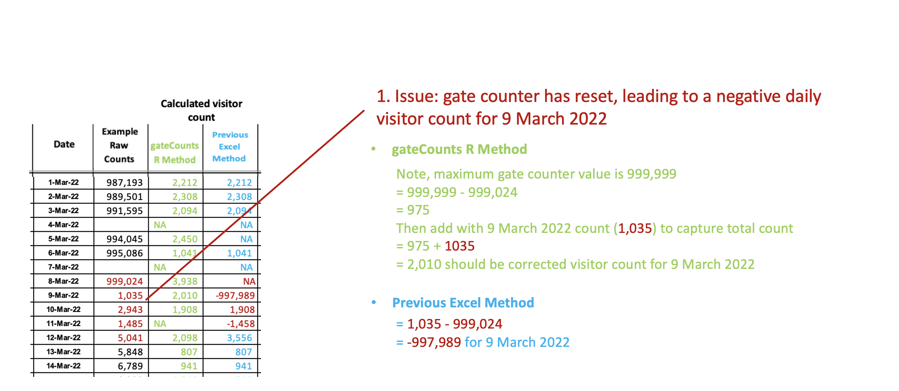
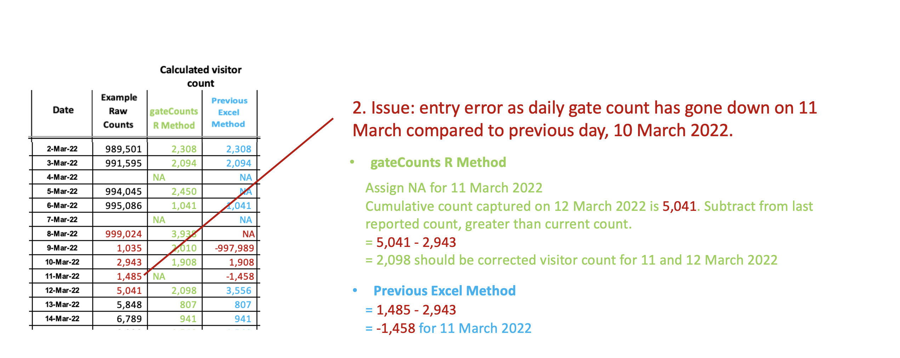
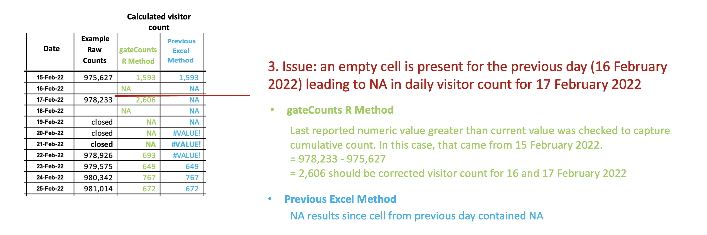
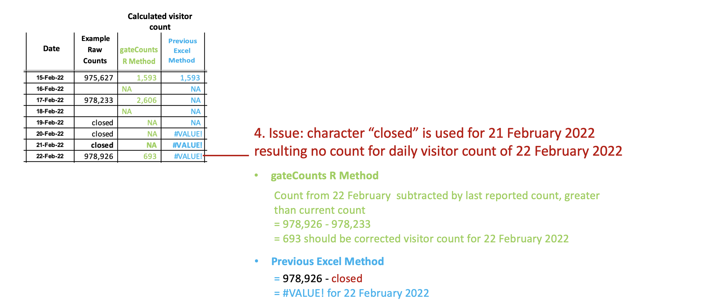
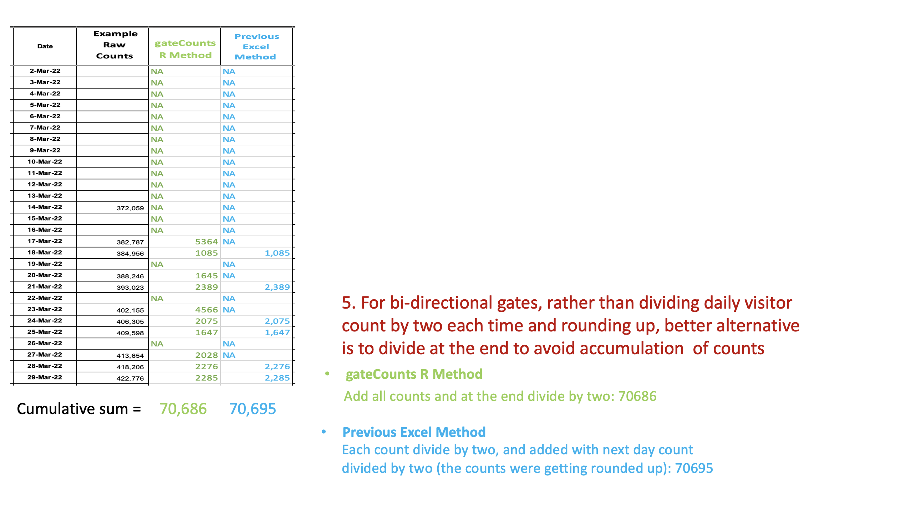

```{r, include = FALSE}
knitr::opts_chunk$set(
  collapse = TRUE,
  comment = "#>"
)
```

## Introduction

**gateCounts** is an R package for calculating daily, weekly, monthly, and cumulative visitor counts, provided raw daily gate counts, gate directionality, and gate counter maximum value. The package was developed to improve methodologies for calculating visitor counts from gate counts, initially using library daily gate count values as an example. However, the package can be applied to calculate visitor counts from any setting. The factors adjusted for are outlined below. To download **gateCounts**, use the following commands:

``` r
require("devtools")
devtools::install_github("anjalisilva/gateCounts",     
                          build_vignettes = TRUE)
library("gateCounts")
```
To list all functions available in the package:
``` r
ls("package:gateCounts")
```

<br>

### Some Issues & How They Are Handled By Package

To calculate visitor counts from raw daily gate counts, today's gate count reading is subtracted from yesterday's reading. Negative visitor counts can result if the gate counter has reset. This package attempts to detect and correct for this.

<div style="text-align:center">



<div style="text-align:left">

<div style="text-align:left">

<div style="text-align:left">

Negative visitor counts can also result from a lower gate count value that has been entered compared to previous day. This may result from manual entry or system errors. This package attempts to detect and correct for this.

<div style="text-align:center">



<div style="text-align:left">

<div style="text-align:left">

<div style="text-align:left">

The package attempts to account for when the daily gate count has been forgotten to be reported or days are skipped. This method doesn’t assign counts for missed days, but rather adjust for cumulative visitor count sum. See below for details:

<div style="text-align:center">



<div style="text-align:left">

<div style="text-align:left">

<div style="text-align:left">

The package checks for any  possible non-numeric characters (e.g., "turned off", "Diagnosis", "closed", "Clean filter"), then adjusts for visitor count by taking past, last reported gate count.

<div style="text-align:center">



<div style="text-align:left">

<div style="text-align:left">

<div style="text-align:left">

### Directionality
If gates are bidirectional, the visitor counts will be divided by two. For cumulative visitor count, our testing has shown that dividing by two after calculating all daily visitor counts helps to provide a better approximation of cumulative gate count, compared to when the daily visitor counts are divided by two and then summed up at the end. Therefore, for cumulative visitor counts from bidirectional gates, all daily visitor counts are summed at then divided by two. Hence, users may find slight differences between summing up daily visitor counts outputted by the package versus cumulative gate count outputted by the package.

<div style="text-align:center">



<div style="text-align:left">

<div style="text-align:left">

<div style="text-align:left">


## Data Simulation

## Package References

- [Silva, A. (2023). R package for Calculating Daily, Weekly, Monthly, Cumulative, and Summary Statistics of Visitor Counts Provided Raw Daily Gate Counts. Unpublished.](https://github.com/anjalisilva/gateCounts)

<br>

## Other References

- [Phillips, J. (2016). Determining Gate Count Reliability in a Library Setting. *Evidence Based Library and Information Practice* 19.](https://journals.library.ualberta.ca/eblip/index.php/EBLIP/article/view/27884/20745)

- [Perera, D. and J. M. Nykolaiszyn (2022). Designing an open-source application to record library gate counts in response to COVID-19. *Journal of Access Services* 19.](https://www.tandfonline.com/doi/abs/10.1080/15367967.2022.2046006?journalCode=wjas20)

- [Müller, K. and H. Wickham (2022). _tibble: Simple Data Frames_. R package version 3.1.8.](https://CRAN.R-project.org/package=tibble)

- [Google. (2022, February 14). Cleaning up gate count statistics. Google Groups. Retrieved September 26, 2022.](https://groups.google.com/a/arl.org/g/arl-assess/c/JQyllZN4gaE)

----

```{r}
sessionInfo()
```
