```{r, include = FALSE}
knitr::opts_chunk$set(
  collapse = TRUE,
  comment = "#>"
)
```

## Introduction

**gateCounts** is an R package for calculating daily, weekly, monthly, and cumulative visitor counts, provided raw daily gate counts, gate directionality, and gate counter maximum value. The package was developed to improve methodologies for calculating visitor counts from gate counts, initially using library daily gate count values as an example. However, the package can be applied to calculate visitor counts from any setting. The factors adjusted for are outlined below. To download **gateCounts**, use the following commands:

``` r
require("devtools")
devtools::install_github("anjalisilva/gateCounts",     
                          build_vignettes = TRUE)
library("gateCounts")
```
To list all functions available in the package:
``` r
ls("package:gateCounts")
```

<br>

### Some Issues & How They Are Handled By Package

To calculate visitor counts from raw daily gate counts, today's gate count reading is subtracted from yesterday's reading. Negative visitor counts can result if the gate counter has reset. This package attempts to detect and correct for this.

<div style="text-align:center">


<div style="text-align:left">

<div style="text-align:left">

<div style="text-align:left">

Negative visitor counts can also result from a lower gate count value that has been entered compared to previous day. This may result from manual entry or system errors. This package attempts to detect and correct for this.

<div style="text-align:center">


<div style="text-align:left">

<div style="text-align:left">

<div style="text-align:left">

The package attempts to account for when the daily gate count has been forgotten to be reported or days are skipped. This method doesn’t assign counts for missed days, but rather adjust for cumulative visitor count sum. See below for details:

<div style="text-align:center">


<div style="text-align:left">

<div style="text-align:left">

<div style="text-align:left">

The package checks for any  possible non-numeric characters (e.g., "turned off", "Diagnosis", "closed", "Clean filter"), then adjusts for visitor count by taking past, last reported gate count.

<div style="text-align:center">


<div style="text-align:left">

<div style="text-align:left">

<div style="text-align:left">

### Directionality
If gates are bidirectional, the visitor counts will be divided by two. For cumulative visitor count, our testing has shown that dividing by two after calculating all daily visitor counts helps to provide a better approximation of cumulative gate count, compared to when the daily visitor counts are divided by two and then summed up at the end. Therefore, for cumulative visitor counts from bidirectional gates, all daily visitor counts are summed at then divided by two. Hence, users may find slight differences between summing up daily visitor counts outputted by the package versus cumulative gate count outputted by the package.

<div style="text-align:center">


<div style="text-align:left">

<div style="text-align:left">

<div style="text-align:left">


## Calculates Daily Visitor Counts From Raw Daily Gate Counts

This package offers a function called **gateCountsToVisitorCounts** that calculates daily and cumulative visitor counts, provided a numeric vector or a tibble containing values of raw daily gate counts and date with a specific format. The function adjusts for several factors outlined above. 

``` r
set.seed(1234)
# Example 1: Unidirectional gates with daily counts
# Simulate gate count data using Poisson distribution
randomCounts1 <- c(sort(rpois(n = 50, lambda = 100)),
                  sort(rpois(n = 50, lambda = 1000)),
                  sort(rpois(n = 82, lambda = 100000)),
                  200000, # max value
                  sort(rpois(n = 50, lambda = 100)),
                  sort(rpois(n = 50, lambda = 1000)),
                  sort(rpois(n = 50, lambda = 100000)))

# Create a tibble with date information
randomCounts1tibble <- tibble::tibble(
                         dates = seq(lubridate::dmy('01-01-2022'),
                         lubridate::dmy('31-12-2022'),
                         by = '1 day')[1:length(randomCounts1)] %>%
                         format('%d-%m-%Y'),
                         counts = randomCounts1)

# Check max value for gate counter maximum
max(randomCounts1tibble$counts, na.rm = TRUE) # 200000

# Run gateCountsToVisitorCounts function to get visitor counts from gate counts
randomCountsEx1 <- gateCounts::gateCountsToVisitorCounts(
                    rawGateCounts = randomCounts1tibble,
                    gateType = "Unidirectional",
                    gatecounterMaxValue = 200000,
                    printMessages = FALSE)

randomCountsEx1$dailyVisitorCounts # access daily adjusted counts
randomCountsEx1$cumulativeVisitorCount # cumulative count for duration
randomCountsEx1$gatecounterMaxValue  # gate counter maximum
randomCountsEx1$gateType # type of gate

```
## Provide Visitor Count Summaries From Daily Visitor Counts

Now that visitor counts are present, either this or any user provided visitor count data could be used in the next function to generate summaries. The **visitorCountSummary** function can be used to calculate weekly, monthly visitor counts and summary statistics like daily, weekly, monthly mean and median, busiest and least busiest day, week, and month for the entire duration for which visitor count data is provided by user. Input should be a numeric vector or a tibble containing values of daily visitor counts and date with a specific format. See argument details using ?visitorCountSummary for more information.

``` r
# Check output and rename column for visitorCountSummary() function
# from above example
visitorCountsEx1<- randomCountsEx1$dailyVisitorCounts %>%
                   dplyr::rename("counts" = "visitorCount") %>%
                   dplyr::select(dates, counts)

# Use visitor counts to get summaries
visitorCountsEx1Summary <-
    gateCounts::visitorCountSummary(
    dailyVisitorCount = visitorCountsEx1)

# See the output
visitorCountsEx1Summary$dailyVisitorCounts # access daily counts
visitorCountsEx1Summary$weeklyVisitorCounts # access weekly counts
visitorCountsEx1Summary$monthlyVisitorCounts # access monthly  counts
visitorCountsEx1Summary$cumulativeVisitorCount # cumulative count for duration
visitorCountsEx1Summary$busiestMonth # busiest month
visitorCountsEx1Summary$leastBusiestMonth # least busiest month
visitorCountsEx1Summary$busiestWeek # busiest week
visitorCountsEx1Summary$leastBusiestWeek # least busiest week
visitorCountsEx1Summary$busiestDay # busiest day
visitorCountsEx1Summary$leastBusiestDay # least busiest day
visitorCountsEx1Summary$dailyAverage  # daily average for duration
visitorCountsEx1Summary$dailyMedian  # daily median for duration
visitorCountsEx1Summary$weeklyAverage # average based on weekly counts
visitorCountsEx1Summary$weeklyMedian # median based on weekly counts
visitorCountsEx1Summary$monthlyAverage # average based on monthly counts
visitorCountsEx1Summary$monthlyMedian # median based on monthly counts
```

## Visualize Daily Visitor Counts For One Institute

The **visitorCountsVisDaily** function that permit to create plots showing daily visitor counts for one institute. Plots include line plots and barplots of month vs daily counts. Plots with log-transformed counts are also provided to better visualize trends with outliers.

``` r
# Visualize visitor counts using visitorCountSummary() function
# First, format the table
visitorCountsEx1 <-
       randomCountsEx1$dailyVisitorCounts %>%
       dplyr::rename("counts" = "visitorCount") %>%
       dplyr::select("dates", "counts")
       
# Visualize daily values
visCountsEx1daily <-
    gateCounts::visitorCountsVisDaily(
    dailyVisitorCount = visitorCountsEx1)
       
# Navigate using arrows to look through different plots.
```

<div style="text-align:center">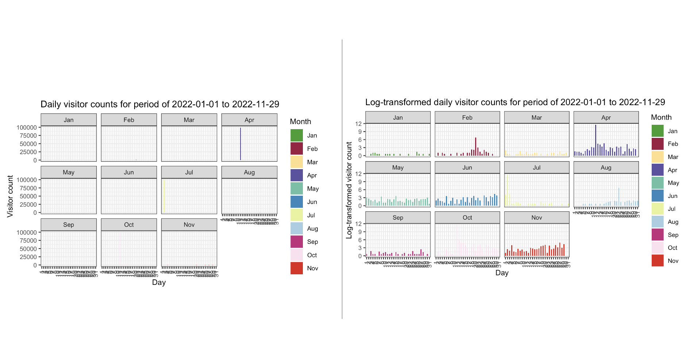

<div style="text-align:left">
Figure of bar plots showing the visitor count (left, above) and log-transformed visitor count (right, above) by month. Log-transformed plots are better for identifying trends.

<div style="text-align:center">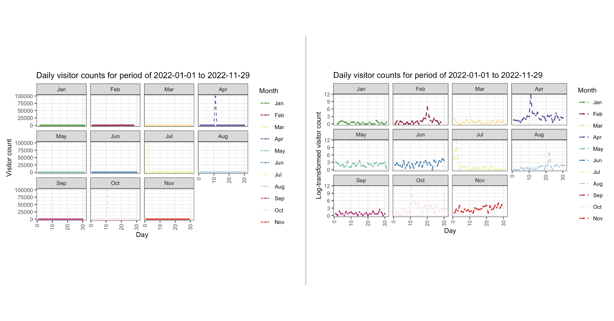

<div style="text-align:left">
Figure of line plots showing the visitor count (left, above) and log-transformed visitor count (right, above) by month. Log-transformed plots are better for identifying trends.

<div style="text-align:center">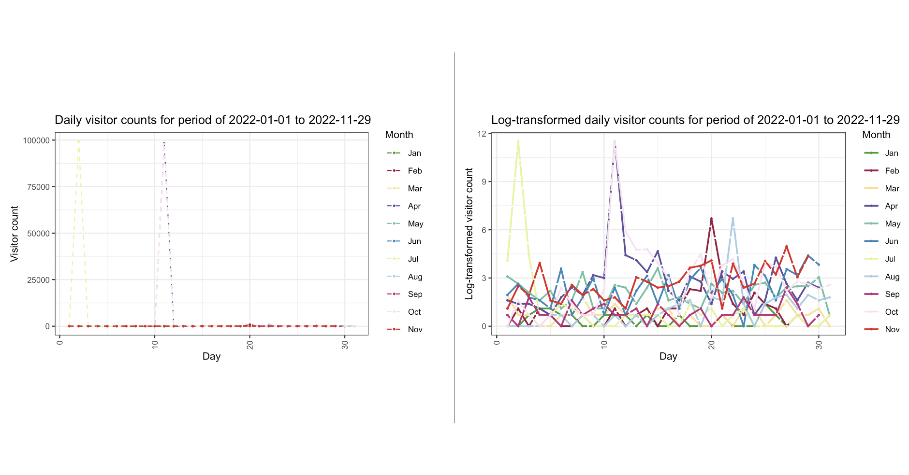

<div style="text-align:left">
Figure of line plots showing the visitor count (left, above) and log-transformed visitor count (right, above). Log-transformed plots are better for identifying trends.

<div style="text-align:center">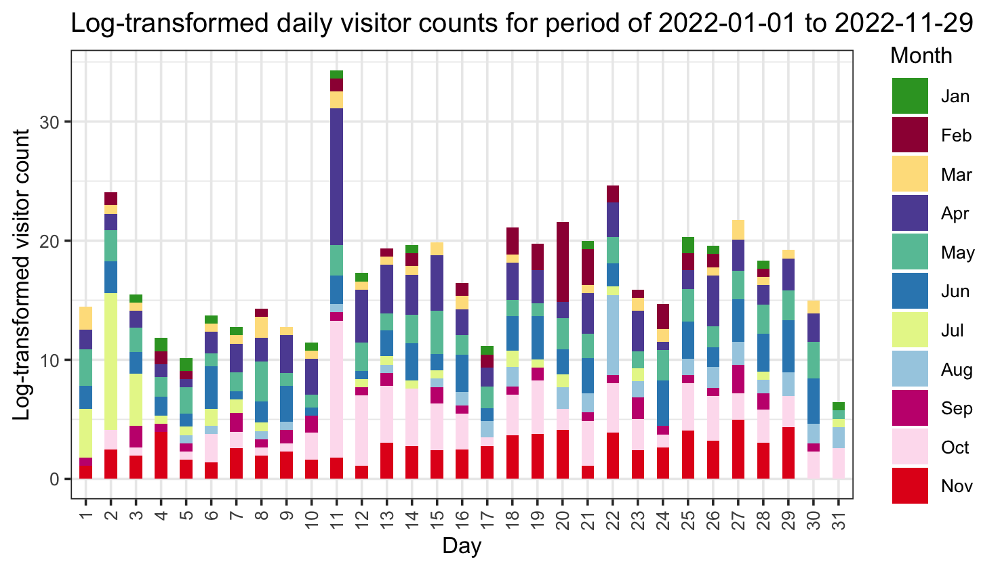

<div style="text-align:left">
Figure of stacked bar plot of log-transformed visitor count (above) by day of month.

<div style="text-align:center">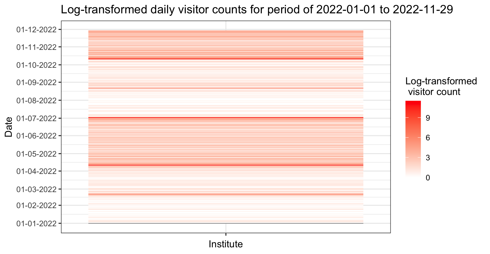

<div style="text-align:left">
Figure of heatmap of log-transformed visitor count (above) by month.

<div style="text-align:left">

## Visualize Weekly Visitor Counts For One Institute

``` r
# Visualize weekly values
visCountsEx1weekly <- 
      gateCounts::visitorCountsVisWeekly(
      dailyVisitorCount = visitorCountsEx1)
# Navigate using arrows to look through different plots.
```
<div style="text-align:center">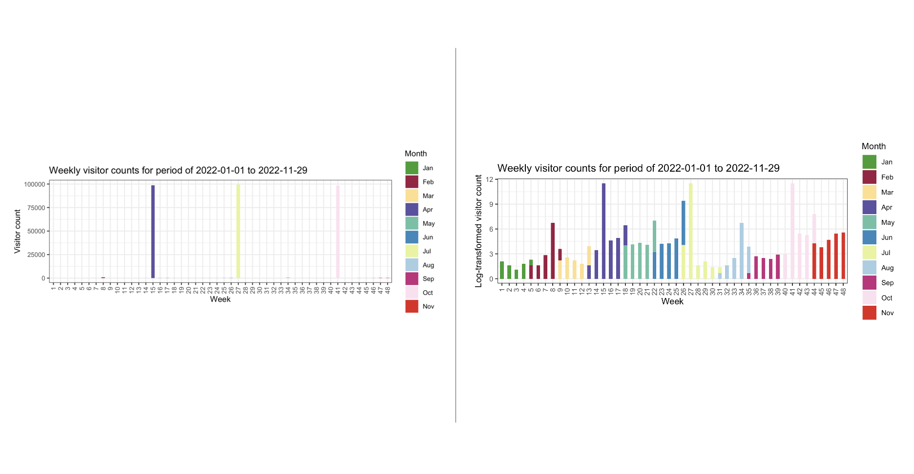

<div style="text-align:left">
Figure of bar plot of visitor counts (left, above) and log-transformed visitor counts (right, above) by week (above).  

<div style="text-align:left">

## Visualize Monthly Visitor Counts For One Institute

``` r
# Visualize weekly values
visCountsEx1month <- gateCounts::visitorCountsVisMonthly(
      dailyVisitorCount = visitorCountsEx1)
# Navigate using arrows to look through different plots.
```

<div style="text-align:center">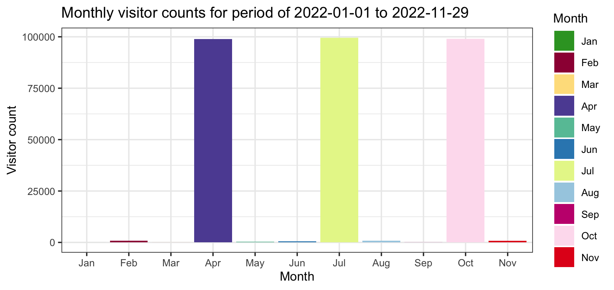

<div style="text-align:left">
Figure of bar plot of visitor counts by month (above).

<div style="text-align:left">

## Visualize Daily Visitor Counts of Multiple Institutes

If the visitor counts are available for multiple institutes over the same date range, the **visitorCountsMultipleVisDaily** function can be used to create plots showing daily visitor counts for multiple institutes. Plots include line plots and barplots. Plots with log-transformed counts are also provided to better visualize trends with outliers.

``` r
set.seed(1234)
# Example 1: Unidirectional gates with daily counts
# Simulate gate count data using Poisson distribution
randomCounts1 <- c(sort(rpois(n = 50, lambda = 1000)),
                   sort(rpois(n = 50, lambda = 1000)),
                   sort(rpois(n = 82, lambda = 100)),
                   sort(rpois(n = 50, lambda = 10)),
                   sort(rpois(n = 50, lambda = 1000)),
                   sort(rpois(n = 50, lambda = 200)))

# Create a tibble with date information
randomCounts1tibble <- tibble::tibble( 
                  dates = seq(lubridate::dmy('01-01-2022'),
                  lubridate::dmy('31-12-2022'),
                  by = '1 day')[1:length(randomCounts1)] %>%
                  format('%d-%m-%Y'),
                  institute1 = randomCounts1)

set.seed(2345)
randomCounts2 <- c(sort(rpois(n = 50, lambda = 10)),
                   sort(rpois(n = 50, lambda = 5000)),
                   sort(rpois(n = 82, lambda = 500)),
                   sort(rpois(n = 50, lambda = 100)),
                   sort(rpois(n = 50, lambda = 3000)),
                   sort(rpois(n = 50, lambda = 1000)))

# Create a tibble with date information
randomCounts2tibble <- tibble::tibble(
                  dates = seq(lubridate::dmy('01-01-2022'),
                  lubridate::dmy('31-12-2022'),
                  by = '1 day')[1:length(randomCounts2)] %>%
                  format('%d-%m-%Y'), 
                  institute2 = randomCounts2)

set.seed(3456)
randomCounts3 <- c(sort(rpois(n = 50, lambda = 20000)),
                   sort(rpois(n = 50, lambda = 5000)),
                   sort(rpois(n = 82, lambda = 500)),
                   sort(rpois(n = 50, lambda = 100)),
                   sort(rpois(n = 50, lambda = 3000)),
                   sort(rpois(n = 50, lambda = 1000)))

# Create a tibble with date information
randomCounts3tibble <- tibble::tibble(   
                 dates = seq(lubridate::dmy('01-01-2022'),
                 lubridate::dmy('31-12-2022'),
                 by='1 day')[1:length(randomCounts3)] %>%
                 format('%d-%m-%Y'),
                 institute3 = randomCounts3)

# Combine data
multipleTibble <- randomCounts1tibble %>%
     dplyr::left_join(randomCounts2tibble) %>%
     dplyr::left_join(randomCounts3tibble)

# Check max value for gate counter maximum
max(multipleTibble$institute1, na.rm = TRUE) # 1107
max(multipleTibble$institute2, na.rm = TRUE) # 5141
max(multipleTibble$institute3, na.rm = TRUE) # 20357

# colnames
colnames(multipleTibble)
# "dates" "institute1" "institute2" "institute3"

# Visualize counts for multiple institutes
visPutEx1 <-
    gateCounts::visitorCountsMultipleVisDaily(
    visitorCountMultiple = multipleTibble)
```

<div style="text-align:center">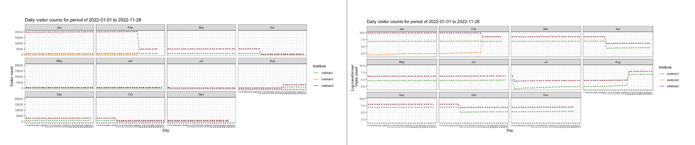

<div style="text-align:left">
Figure of line plot of visitor counts (left, above) and log-transformed visitor counts (right, above) by month and institute.

<div style="text-align:left">

<div style="text-align:center">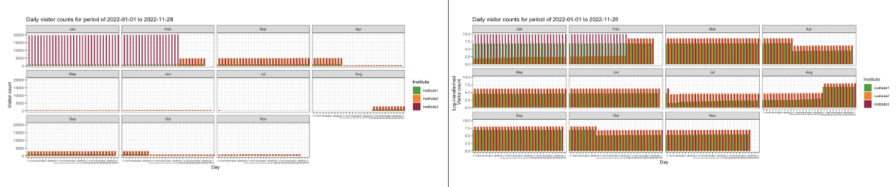

<div style="text-align:left">
Figure of bar plot of visitor counts (left, above) and log-transformed visitor counts (right, above) by month and institute.
<div style="text-align:left">

<div style="text-align:center">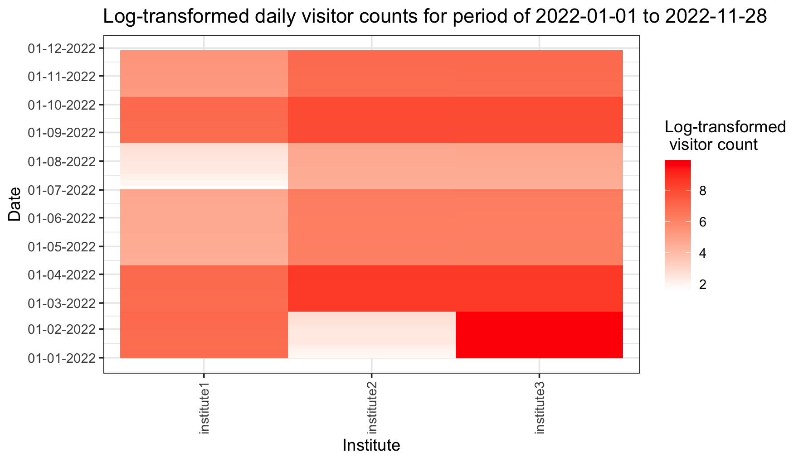

<div style="text-align:left">
Heatmap of log-transformed visitor counts by institute (above).

<div style="text-align:left">

<div style="text-align:center">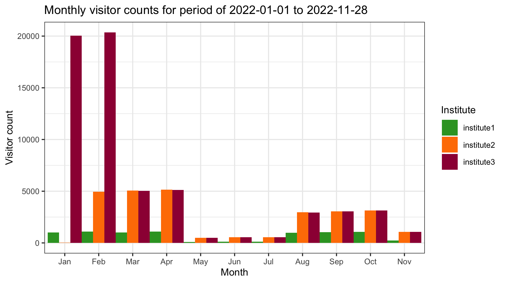

<div style="text-align:left">
Figure of bar plot of visitor counts by month and institute (above).

<div style="text-align:left">

## Package References

- [Silva, A. (2023). R package for Calculating Daily, Weekly, Monthly, Cumulative, and Summary Statistics of Visitor Counts Provided Raw Daily Gate Counts. Unpublished.](https://github.com/anjalisilva/gateCounts)

<br>

## Other References

- [Phillips, J. (2016). Determining Gate Count Reliability in a Library Setting. *Evidence Based Library and Information Practice* 19.](https://journals.library.ualberta.ca/eblip/index.php/EBLIP/article/view/27884/20745)

- [Perera, D. and J. M. Nykolaiszyn (2022). Designing an open-source application to record library gate counts in response to COVID-19. *Journal of Access Services* 19.](https://www.tandfonline.com/doi/abs/10.1080/15367967.2022.2046006?journalCode=wjas20)

- [Müller, K. and H. Wickham (2022). _tibble: Simple Data Frames_. R package version 3.1.8.](https://CRAN.R-project.org/package=tibble)

- [Google. (2022, February 14). Cleaning up gate count statistics. Google Groups. Retrieved September 26, 2022.](https://groups.google.com/a/arl.org/g/arl-assess/c/JQyllZN4gaE)

----

```{r}
sessionInfo()
```
